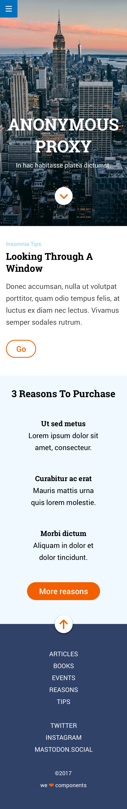
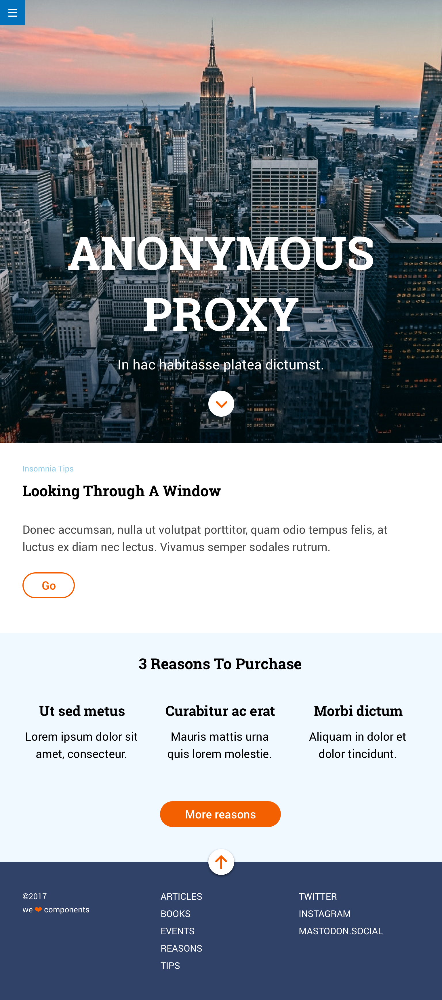
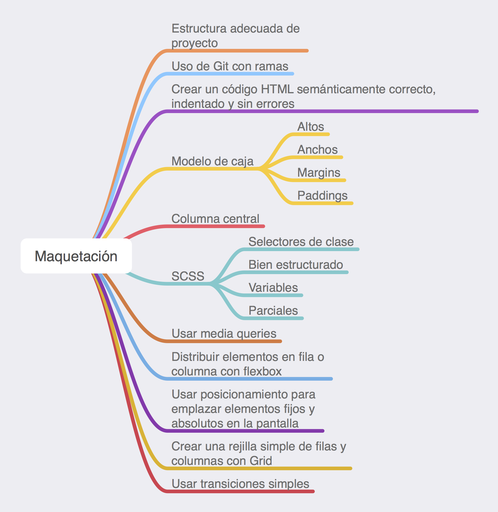

### My exercise: [Anonymous Proxy](http://beta.adalab.es/modulo-1-evaluacion-final-mararochafernandez/)

### Feature highlights:

- **Mobile First** Responsive Web Design.
- **Semantic HTML structure** to provide additional meaning to the markup.
- **CSS Flexbox** and **CSS Grid** layouts, working with both at the same time.
- SASS features to create reusable and maintainable blocks of code: **partials**, **nesting**, **mixins**, **variables**, **@import and @extend directives**...
- Writing **media queries** with mixins and @content directive to allow for ease of maintenance.
- **CSS Transitions** and **CSS Animations** with keyframes (for beginners), improving user experience.
- Version control and branching with **Git** to manage the code.
- **Adalab Web Starter Kit**: resources and tools (**Node JS**, **NPM**, **Gulp**) to quickly start web development projects.

#### Other features:
- Box model and positioning (fixed and absolute).
- Gradient and shadow styles.
- Class selectors.
- Template engine.
- Indent code.
- File and folders well structured.
- Google Fonts and Font Awesome.

---

# Evaluación final del módulo 1

Desarrollar página web de acuerdo al diseño dado. Utilizando:
- Sass
- Flexbox y Grid
- Media queries
- Transiciones

## Recursos

- Crear repositorio en GitHub Classroom y clonar.
- Incluir Adalab Web Starter Kit.
- Descargar imágenes e iconos.

## Diseños en Zeplin

<table>
  <tr>
    <td>
      
    </td>
    <td>
      
    </td>
    <td>
      
    </td>
  </tr>
</table>

## Maquetación

- Botón de hamburguesa: fijo en la esquina superior izquierda, no desaparece al hacer scroll, enlaza con la web de Adalab, no despliega ningún menú.
- Primer módulo (Anonymous Proxy): maquetado con flexbox, ocupa el alto de la ventana del navegador.
- Segundo módulo (Looking Through A Window): maquetación CSS libre.
- Tercer módulo (3 Reasons To Purchase): los 3 elementos del listado maquetados con Grid.
- Cuarto módulo (footer): maquetado con flexbox, todos los textos de la columna "articles" y "twitter" enlazan con la web de Adalab.

## Interacción

- Botón flecha del hero enlaza con 3 Reasons To Porchase.
- Botón flecha del footer enlaza con el inicio de la página.
- Todos los enlaces del pie enlazan con la web de Adalab.
- El hover de los botones Go y More reasons deben incluir una transición.
- BONUS: animación en el botón del footer.

## Consideraciones

- Degradado vertical en la imagen del hero.
- Año actual en el copyright.

---

# Entrega

- Fecha: miércoles 24 a las 14:00.
- Actualizar carpeta docs/ y publicar en GitHub Pages.

## Criterios de evaluación

### GENERAL
- **Estructura adecuada de ficheros y carpetas, y enlazar bien los ficheros.**
- Uso de control de versiones con ramas.

### HTML
- **Código perfectamente indentado.**
- **Sintaxis correcta y bien estructurado.**
- **Etiquetas semánticas adecuadas para cada pieza de contenido.**

### CSS / SASS
- **Código perfectamente indentado.**
- **Sintaxis correcta y bien estructurado.**
- Variables, anidación y parciales.
- **Código CSS que usa de forma intensiva selectores de clase (no de etiqueta ni de id).**
- **Selectores de clase en inglés.**
- **Modelo de caja adecuado para especificar tamaño, relleno y márgenes.**
- Estilos de texto y fondo para distintos tipos de elementos.
- **Flexbox de forma adecuada para organizar elemento en cajas flexibles.**
- **Media queries para ajustarse a distintos tamaños de dispositivo.**
- Posicionamiento para emplazar elementos fijos y absolutos.
- Grid para emplazar elementos usando una rejilla.
- Transiciones para dotar de dinamismo al proyecto.

### ISSUES
- Evaluación intermedia.

---

# Resumen del módulo

